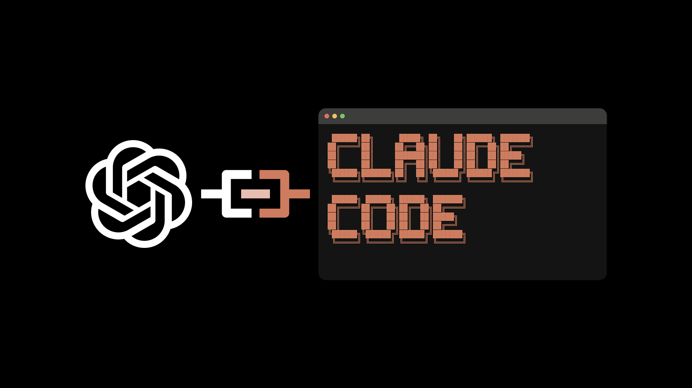

# Centralized Inference Endpoint

A production-ready FastAPI application that provides a unified, multi-provider LLM inference proxy with automatic API key fallback, rate limiting, structured logging, and health monitoring. Supports OpenAI and Anthropic APIs with seamless format conversion and cross-provider routing.

**Warning:** This repo is under heavy development and is not yet ready for production use; be wary of inbound changed, frequent refactors, and more.



## Features

- **Multi-Provider Support**: Route requests to OpenAI or Anthropic based on model configuration
- **API Key Fallback**: Automatic failover to backup API keys when rate limits or errors occur
- **Circuit Breaker Pattern**: Failed keys enter cooldown period before retry
- **Format Conversion**: Seamless conversion between OpenAI and Anthropic API formats (not perfect yet)
- **Streaming Support**: Full Server-Sent Events (SSE) streaming for both providers
- **Structured Logging**: Comprehensive request/response logging to SQLite database
- **Rate Limiting**: Configurable per-client rate limits (requests and tokens per minute)
- **Health Checks**: Basic and detailed health monitoring endpoints
- **CORS Support**: Configurable Cross-Origin Resource Sharing
- **Error Handling**: Provider-standardized error responses matching OpenAI/Anthropic formats

## Installation

1. Clone the repository:
```bash
git clone https://github.com/BenItBuhner/model-proxy.git
cd centralized-inference-endpoint
```

2. Install dependencies:
```bash
# Install uv if you don't have it
pip install uv

# Install project dependencies
uv sync
```

3. Set up environment variables (see [Configuration](#configuration) below)

## Configuration

### Environment Variables

Create a `.env` file or set the following environment variables:

#### Required
- `CLIENT_API_KEY`: API key for client authentication (required for all requests)

#### Provider API Keys
- `OPENAI_API_KEY`: Primary OpenAI API key (or `OPENAI_API_KEY_1`)
- `OPENAI_API_KEY_1`, `OPENAI_API_KEY_2`, ...: Additional OpenAI API keys for fallback
- `ANTHROPIC_API_KEY`: Primary Anthropic API key (or `ANTHROPIC_API_KEY_1`)
- `ANTHROPIC_API_KEY_1`, `ANTHROPIC_API_KEY_2`, ...: Additional Anthropic API keys for fallback

#### Optional
- `KEY_COOLDOWN_SECONDS`: Cooldown period for failed API keys (default: 300 seconds / 5 minutes)
- `REQUIRE_CLIENT_API_KEY`: Set to "true" to fail startup if CLIENT_API_KEY is missing (default: "false")
- `FAIL_ON_STARTUP_VALIDATION`: Set to "true" to fail startup on validation errors (default: "false")
- `CORS_ORIGINS`: Comma-separated list of allowed CORS origins (default: "*")
- `RATE_LIMIT_REQUESTS_PER_MINUTE`: Maximum requests per minute per client (default: 60)
- `RATE_LIMIT_TOKENS_PER_MINUTE`: Maximum tokens per minute per client (default: 100000)

### Provider Configuration

Provider settings are configured in JSON files under `config/providers/`:

- `config/providers/openai.json`: OpenAI provider configuration
- `config/providers/anthropic.json`: Anthropic provider configuration

Each provider config includes:
- `endpoints`: Base URL and endpoint paths
- `authentication`: Header format and authentication method
- `api_key_env_patterns`: Environment variable patterns for API keys
- `request_config`: Timeouts, retries, and default parameters
- `proxy_support`: Optional proxy URL override for OpenAI-compatible endpoints

### Model Configuration

To add a new model, create a JSON file in `config/models/` named `<logical_model>.json` with the routing configuration. Models are defined as individual routing configuration files under `config/models/`. Each logical model has its own JSON file named `<logical_model>.json` that describes routing (primary provider, fallbacks, api key env vars, timeouts, and wire-protocol).

Example `config/models/gpt-5-2.json` (simplified):

```json
{
  "logical_name": "gpt-5.2",
  "timeout_seconds": 60,
  "model_routings": [
    {
      "id": "primary",
      "wire_protocol": "openai",
      "provider": "openai",
      "model": "gpt-5.2",
      "api_key_env": ["OPENAI_API_KEY", "OPENAI_API_KEY_1"]
    },
    {
      "id": "secondary",
      "wire_protocol": "openai",
      "provider": "azure",
      "model": "gpt-5.2",
      "api_key_env": ["AZURE_API_KEY"]
    }
  ],
  "fallback_model_routings": ["gpt-5.1"]
}
```

Notes:
- The new routing system reads per-model JSON files in `config/models/` using `app.routing.config_loader.ModelConfigLoader`.
- Use `config_loader.get_available_models()` to list logical models programmatically.
- If you previously used a single `config/models.json` (the legacy flat mapping), you should migrate to per-model files by creating one JSON file per logical model in `config/models/`. A migration script can be added to automate splitting the flat mapping into per-model files; otherwise create files by hand using the example above.

## Running the Application

### Local Development

```bash
uv run uvicorn app.main:app --port 9876
```

The API will be available at `http://localhost:9876`

### Docker

Build the Docker image:
```bash
docker build -t centralized-inference-endpoint .
```

Run the container:
```bash
docker run -d -p 9876:9876 \
  -e CLIENT_API_KEY=your_client_key \
  -e OPENAI_API_KEY_1=your_openai_key \
  -e ANTHROPIC_API_KEY_1=your_anthropic_key \
  centralized-inference-endpoint
```

### Docker Compose

For local development:
```bash
docker-compose up
```

For production:
```bash
docker-compose -f docker-compose.prod.yml up -d
```

## API Endpoints

### OpenAI-Compatible Endpoints

#### POST `/v1/chat/completions`
OpenAI-compatible chat completions endpoint (non-streaming).

**Request:**
```json
{
  "model": "gpt-4",
  "messages": [
    {"role": "user", "content": "Hello!"}
  ],
  "temperature": 0.7,
  "max_tokens": 100
}
```

**Response:** Standard OpenAI chat completion response format.

#### POST `/v1/chat/completions-stream`
OpenAI-compatible streaming chat completions endpoint.

**Request:** Same as `/v1/chat/completions` but returns Server-Sent Events stream.

**Response:** SSE stream with OpenAI-formatted chunks.

### Anthropic-Compatible Endpoints

#### POST `/v1/messages`
Anthropic-compatible messages endpoint (non-streaming).

**Request:**
```json
{
  "model": "claude-3-opus",
  "messages": [
    {"role": "user", "content": "Hello!"}
  ],
  "max_tokens": 100,
  "temperature": 0.7
}
```

**Response:** Standard Anthropic message response format.

#### POST `/v1/messages-stream`
Anthropic-compatible streaming messages endpoint.

**Request:** Same as `/v1/messages` but returns Server-Sent Events stream.

**Response:** SSE stream with Anthropic-formatted chunks.

### Health Check Endpoints

#### GET `/health`
Basic health check. Returns 200 if database is accessible.

**Response:**
```json
{
  "status": "healthy",
  "timestamp": "2024-01-01T00:00:00Z"
}
```

#### GET `/health/detailed`
Detailed health check with component status.

**Response:**
```json
{
  "status": "healthy",
  "timestamp": "2024-01-01T00:00:00Z",
  "uptime_seconds": 3600,
  "components": {
    "database": {"status": "healthy", "response_time_ms": 5},
    "providers": {
      "openai": {"status": "healthy", "keys_available": 2},
      "anthropic": {"status": "healthy", "keys_available": 1}
    },
    "model_config": {"status": "healthy", "models_count": 10},
    "provider_configs": {"status": "healthy", "providers_loaded": 2}
  }
}
```

## Authentication

All endpoints require authentication via the `Authorization` header:

```
Authorization: Bearer <CLIENT_API_KEY>
```

Or simply:
```
Authorization: <CLIENT_API_KEY>
```

The `Bearer` prefix is optional and case-insensitive.

## Error Handling

Errors are returned in provider-standardized formats:

### OpenAI Format
```json
{
  "error": {
    "message": "Error description",
    "type": "error_type",
    "code": "error_code"
  }
}
```

### Anthropic Format
```json
{
  "error": {
    "message": "Error description",
    "type": "error_type"
  }
}
```

## Development

### Running Tests

```bash
uv run pytest tests/ -v
```
